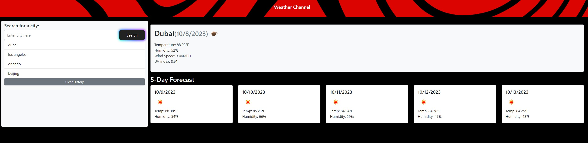

# My Weather Channel

This is a weather dashboard application that allows users to search for weather information for cities. The dashboard provides current weather conditions as well as a 5-day forecast for the selected city. Additionally, it keeps a search history for quick access to previously searched cities.

[Check out page!](https://quebvihn.github.io/Weather-DB/)

## Table of Contents

- [Usage](#usage)
- [Features](#features)
- [Getting Started](#getting-started)
- [Technologies Used](#technologies-used)
- [License](#license)

## Usage

To use the Weather Dashboard, follow these steps:

1. Open the Weather Dashboard application.

2. In the form input, enter the name of the city you want to search for and click the "Search" button.

3. The application will display the current weather conditions and a 5-day forecast for the selected city.

4. The city will be added to the search history for easy access in the future.

5. To view the current weather conditions again for a city in the search history, simply click on that city in the history list.

## Features

- **Search for City**: Users can search for weather information for a specific city by entering its name.

- **Current Weather Conditions**: The dashboard displays the city name, date, weather condition icon, temperature, humidity, and wind speed for the selected city's current weather.

- **5-Day Forecast**: Users can view a 5-day weather forecast for the selected city, including the date, weather condition icon, temperature, wind speed, and humidity.

- **Search History**: The application keeps a history of searched cities, allowing users to quickly access the weather information for previously searched locations.

## Getting Started

To get started with the Weather Dashboard, follow these steps:

1. Clone this repository to your local machine.

2. Open the `index.html` file in a web browser to access the Weather Dashboard.

3. Enter the name of the city you want to search for in the input field and click the "Search" button.

4. Explore the current weather conditions and 5-day forecast for the selected city.

## Technologies Used

This project makes use of the following technologies:

- HTML
- CSS
- JavaScript
- [OpenWeatherMap API](https://openweathermap.org/api) for weather data

## License

This project is licensed under the MIT License - see the [LICENSE](LICENSE) file for details.

---

Thank you for using the Weather Dashboard! If you have any questions or encounter any issues, please feel free to [contact us](mailto:your-email@example.com). We hope you find this dashboard helpful for checking weather conditions in your favorite cities.

